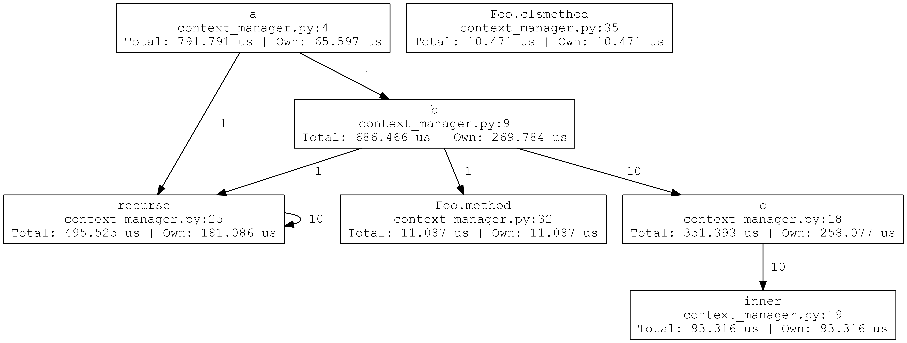
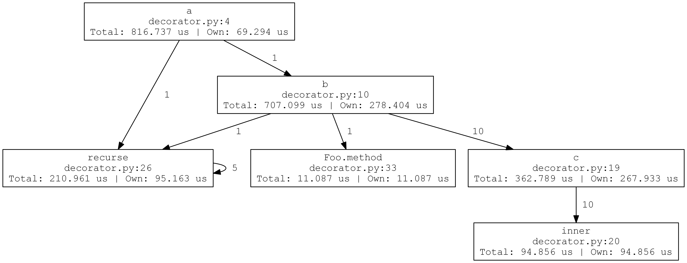

# Snarl

[](https://travis-ci.org/JoshKarpel/snarl)
[](https://codecov.io/gh/JoshKarpel/snarl)

Snarl is a tool for creating execution graphs of Python programs.

Installation: `pip install git+https://github.com/JoshKarpel/snarl.git`

Here's an example:

```python
from snarl import Snarl

def a():
    b()
    recurse(2)

def b():
    for _ in range(10):
        c()
    recurse(3)

    f = Foo()
    f.method(5)

def c():
    def inner():
        pass

    inner()

def recurse(n):
    if n == 0:
        return
    recurse(n - 1)

class Foo:
    def method(self, x):
        pass

    @classmethod
    def clsmethod(cls):
        return cls()

with Snarl() as snarl:
    a()
    recurse(5)

    Foo.clsmethod()

dot = snarl.dot(format = 'png')
dot.render(view = True)
```



The region that we collected information on was defined by the `with` block.
We can use the `snarled` decorator to attach to a function instead:

```python
from snarl import snarled

@snarled
def a():
    b()
    recurse(2)

def b():
    for _ in range(10):
        c()
    recurse(3)

    f = Foo()
    f.method(5)

def c():
    def inner():
        pass

    inner()

def recurse(n):
    if n == 0:
        return
    recurse(n - 1)

class Foo:
    def method(self, x):
        pass

    @classmethod
    def clsmethod(cls):
        return cls()

a()
recurse(5)

Foo.clsmethod()

dot = a.snarl.dot(name = 'decorator', format = 'png')
dot.render(view = True)
```



Now we don't see the `recurse(5)` or `Foo.clsmethod()` calls because the "root" of the execution graph is the function `a`.
